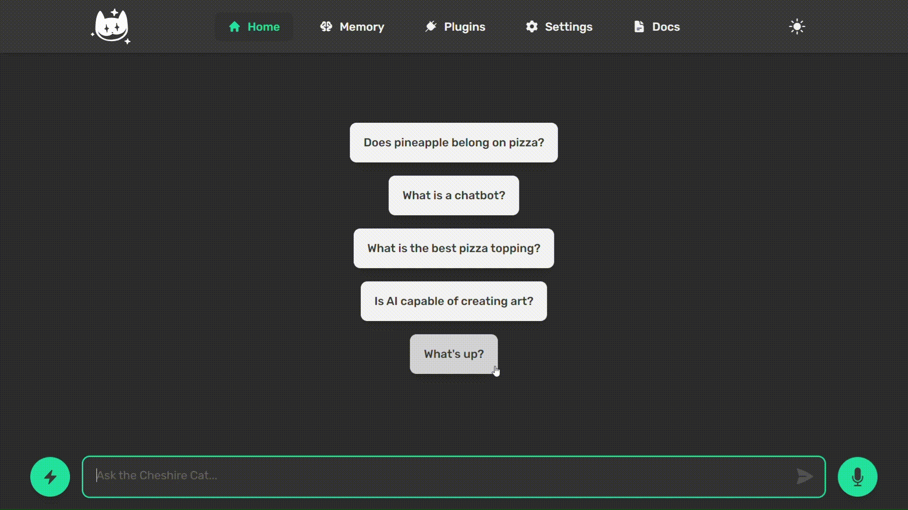

# FinCat-ETF-Checker

### Retrieves informations about ETFs from JustETF

FinCat is a plugin for the Cheshire Cat that lets retrive some information about ETFs. You just need to provide the cat with an ISIN or a Ticker and it will search from the ones that are aveilable on [JustETF](justetf.com).

## Video

In the GIF above you can see that I specified a couple of ISINs (I could've used also their tickers) and it provided some basic info.